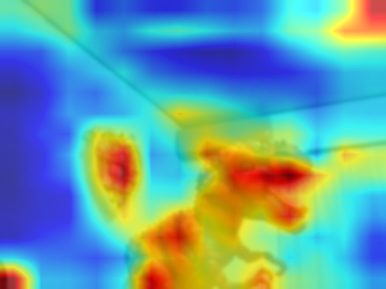

# 3d2dconvert
3D capture convert to 2D imags real time project

## Base on Opencv and Pillow with ease
- 3D capture by single cam with opencv technology to 2D heat map abstract image
- It is not sure usage now.
- We'll consider low cost capturing or analysis.

# Normal edition
```
python 3dclr2d.py
```

# low effect edition 
- It is available to see original image with heatmap.

```
python 3dpicture.py

```

# Sample image

